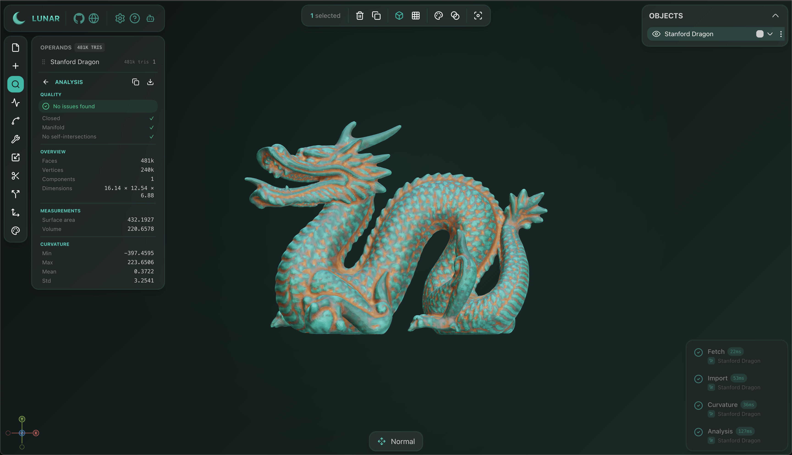

<p align="center">
  
  <br />
  <strong>Lunar</strong>
</p>

<p align="center">
  Browser-based geometry processing. AI-controllable via MCP. Powered by <a href="https://github.com/polydera/trueform">trueform</a>.
</p>

<p align="center">
  <a href="https://lunar.polydera.com"><strong>Live App</strong></a> · <a href="https://trueform.polydera.com"><strong>trueform Docs</strong></a>
</p>

<br />

<p align="center">
  
</p>

## Features

- **Analysis** — topology, curvature, distance fields, histograms, per-component stats
- **Arrangements & booleans** — booleans, multi-mesh arrangements, polygon soup arrangements and self-intersection resolution
- **Remeshing** — isotropic remesh, decimation, Laplacian and Taubin smoothing
- **Isocontours & isobands** — scalar field level sets with curve triangulation
- **Alignment** — ICP and OBB registration, frame alignment
- **AI-controllable** — full [MCP](https://modelcontextprotocol.io) server; every operator callable by AI agents
- **Import / Export** — STL and OBJ with drag-and-drop

All computation runs in [trueform](https://github.com/polydera/trueform)'s WASM runtime — parallel, exact, and browser-native.

## Getting Started

```bash
pnpm install
pnpm dev              # Vite dev server (no MCP)
pnpm dev:mcp          # build + wrangler dev (full MCP stack, port 8788)
```

Requires Node 20+ and [pnpm](https://pnpm.io). `pnpm dev` is fastest for UI work. `pnpm dev:mcp` runs the full Cloudflare Worker stack locally with MCP support.

## AI Integration

Lunar exposes an [MCP](https://modelcontextprotocol.io) server. Connect any MCP-compatible AI assistant (Claude, etc.) to control the scene programmatically — create geometry, run operators, inspect results, take screenshots. See the MCP panel in the app for the connection URL.

## Tech Stack

Vue 3 · Three.js · [trueform](https://github.com/polydera/trueform) (WASM) · Nuxt UI · Vite

## License

Dual-licensed: [PolyForm Noncommercial 1.0.0](LICENSE.noncommercial) for noncommercial use, [commercial licenses](mailto:info@polydera.com) available.
